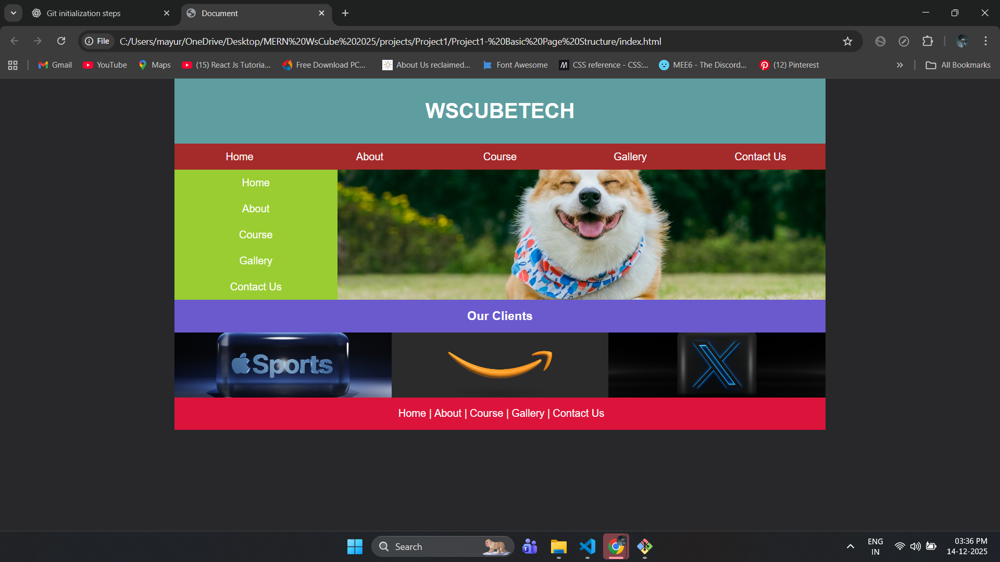

# wscube2025-project1-Basic_Page_Structure

## 📌 Project Overview

This project is a **basic web page layout** created as part of **WsCube Tech 2025 training**. It focuses on understanding **HTML page structure** and **CSS layout techniques** using traditional methods like `float` and `clear`.

The page demonstrates how different sections of a website (header, navigation, sidebar, main content, clients section, and footer) are structured and styled.

---

## Preview


## 🧱 Page Structure

The layout includes the following sections:

* **Header** – Displays the website title
* **Navigation Bar** – Horizontal menu with multiple links
* **Main Section**

  * **Sidebar (Aside)** – Vertical navigation menu
  * **Main Image Area** – Content image beside the sidebar
* **Clients Section** – Displays client images in a row
* **Footer** – Bottom navigation links

---

## 🎨 Styling & Layout Concepts Used

* CSS `float` for layout positioning
* `.clear` class to clear floated elements
* Fixed-width centered container (`wrapper`)
* Flexbox for centering text inside elements
* `object-fit` and `object-position` for responsive images
* Background colors to visually differentiate sections

---

## 🛠️ Tech Stack

* **HTML5** – Semantic structure and layout
* **CSS3** – Styling and layout management

---

## 🎯 Purpose of the Project

* Practice basic HTML page structure
* Understand layout building using floats
* Learn how different website sections align together
* Strengthen fundamentals before moving to modern layouts (Flexbox & Grid)

---

## 📂 Project Files

```
📁 project-root
│── index.html
│── style.css
```

---

## 🚀 Learnings

* Structuring a complete webpage using HTML
* Creating multi-section layouts using CSS floats
* Managing layout flow with clear fixes
* Styling navigation menus and image sections

---

## 👤 Author

**Mayur Agarwal**

---

## 📌 Note

This project uses **traditional CSS layout techniques** for learning purposes. Modern projects generally use **Flexbox** or **CSS Grid** for better responsiveness and maintainability.
